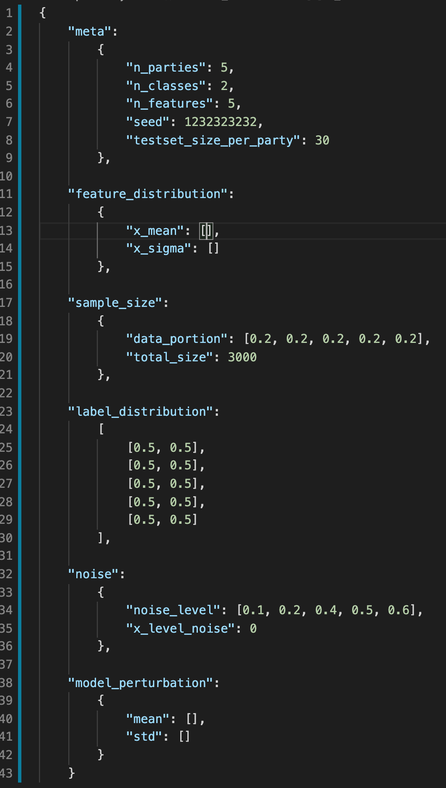

# Synthetic dataset generator for federated learning

## Context

* **Federated Learning:**
</br>
In centralized or distributed learning setting, data are iid in nature. However, in the context of federeated learning, data are non-iid. In view of this, various artifical partitioned datasets have been experimented for benchmarking federated learning. Specifically, LEAF implement a synthetic data generator for fl setting. However, the control over the heterogeneity of the datasets are rather low. In view of this, a more controlled framework is proposed here. 

## Controls
  * **Data size difference:** The user has control over the portion of data sample size for each party.</br>
  * **Model weight difference:** The user has control over the heterogeneity of the underlying model weights across all the parties
  * **Data generation process difference:** The feature difference controls the heterogeneity of the feature space among parties.
  * **Label distribution difference:** The user has the control over the label distribution among parties. 

## Details
  * **meta** </br>
  meta indicates the meta information of the particular synthetic dataset generator. The information here applies to all parties in this fl task.</br>
    * ***n_parties*** </br>
    n_parties indicates the number of parties in current simulated fl training task.
    * ***n_classes*** </br>
    n_classes indicates the number of classes in current simulated fl training task.
    * ***n_features*** </br>
    n_features indicates the number of features in current simulated fl training task.
    * ***seed*** </br>
    seed indicates the random seed used in current simulated fl training task.
    * ***testset_size_per_party*** </br>
    testset_size_per_party indicates the number of test sample that each party generate in current simulated fl training task. It applies to all parties.
  * **feature_distribution** </br>
  feature_distribution indicates the degree of heterogeneity of the features among all the parties. Given the fact that the generation of features are a multi-gaussian sampling process with mean for each feature and a covarance matrix Sigma apply to all parties, we sampled the mean for each feature of all client from the gaussian distribution with mean and std indicated in x_mean (list of length num_features) and x_sigma (list of length num_features)</br>
    * ***x_mean*** </br>
    List of length num_features. Each value is the mean of that specific feature for the guassian sampling that is going to happen to obtain the mean for each client for that particular feature.
    * ***x_sigma*** </br>
    List of length num_features. Each value is the std of that specific feature for the guassian sampling that is going to happen to obtain the mean for each client for that particular feature.

* **sample_size** </br>
sample_size indicates the total number of data samples, traning set only. And also indicates the number of data samples for each party</br>
  * ***data_portion*** </br>
  list of length num_parties or num_parties-1. Each value indicates the portion of the total size that each party holds. If length equal to num_parties -1, the last value will be calculated automatically. For the case of num_parties, all values have to sums up to 1. For the case of num_parties-1, all values have to sums up to be less than or equal to 1. 
  * ***total_size*** </br>
  Total number of data samples that all parties have, only include trianing set.

* **label_distribution** </br>
label_distribution indicates the label distribution for each party that user would like to have for the synthetic datasets. Any party with empty indicates that label distribution is balanced for that specific party. The expected length of this list of num_parties or num_parties -1. For the case of num_parties, all values have to sums up to 1. For the case of num_parties -1, all the values have to sum up to less than or equal to 1. 

* **noise** </br>
noise indicates the stage where the noise are being injected into the dataset, as well as the maginitude of the noise that is being injected. </br>
  * ***noise_level*** </br>
  A list of noise scale that user would like to have for each party. Any party with undefined noise will be deemed as zero noise. If the length of the list are longer than the number of parties, extra entries will be trimmed. 
  * ***x_level_noise*** </br>
  Whether the noise are injected before or after the production of labels. 
  If set to 1, the noise will be injected before the produciton of label. 
  If set to 0, the noise will be injected after the production of label.

* **model_perturbation** </br>
model_perturbation indicates the amount of pertubrbation that user would like to added into local models.</br>
  * ***mean*** </br>
  A list of means for each party. Each mean serve as the mean for the Gaussian distribution from which the entries of the perturbation matrix are sampled from.  
  * ***std*** </br>
  A list of std for each party. Each std serve as the std for the Gaussian distribution from which the entries of the perturbation matrix are sampled from.  
  
 


## Usage
The user just need to specify the parameters in param.json. A example of the params are shown below.



To generate the synthetic datasets, the user only need needs to run command 
```
python main.py
```

## Algorithm
The algorithm are shown in the pseudocode below.

