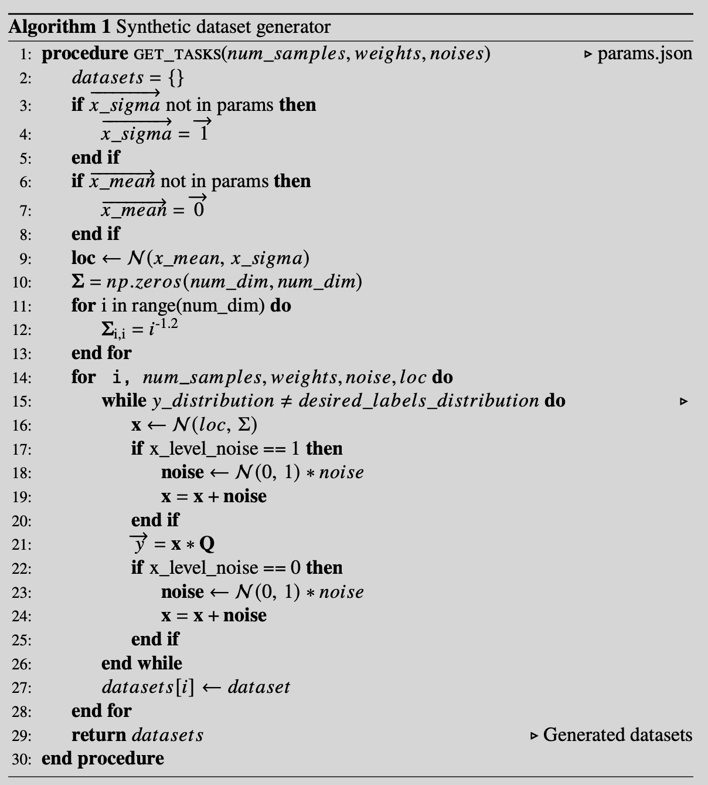

# Synthetic dataset generator for federated learning

## Context

* **Federated Learning:**
 
In centralized or distributed learning setting, data are iid in nature. However, in the context of federeated learning, data are non-iid. In view of this, various artifical partitioned datasets have been experimented for benchmarking federated learning. Specifically, LEAF implement a synthetic data generator for fl setting. However, the control over the heterogeneity of the datasets are rather low. In view of this, a more controlled framework is proposed here. 

## Parameters
  * **Data sample size difference:** The user has control over the portion of data sample size for each party.
  * **Data generation difference:** The feature difference is specified, which is a parameter indicating the std of the distribution, from which the means of the multivariant guassian distribution (feature distribution) will be drawn. 
  * **Label distribution difference:** The user has the control over the label distribution among parties. 

## Usage
 
The user just need to specify the parameters in param.json. 

## Algorithm

